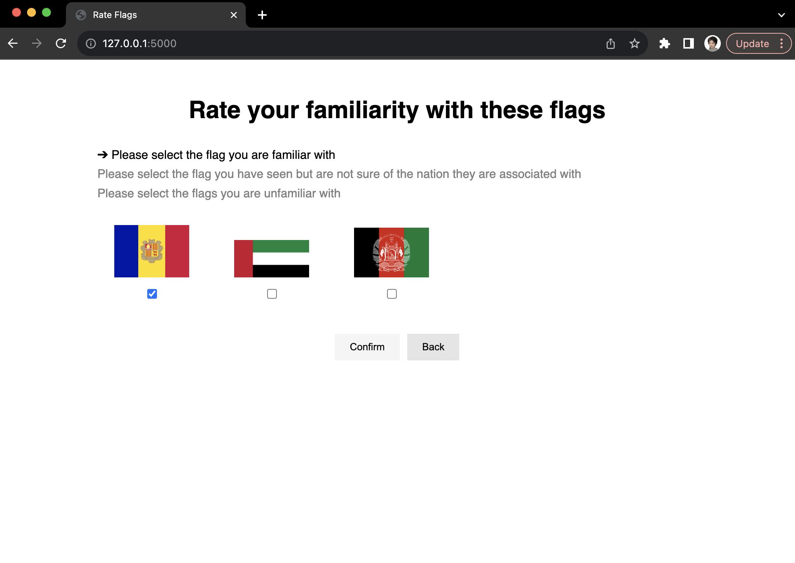
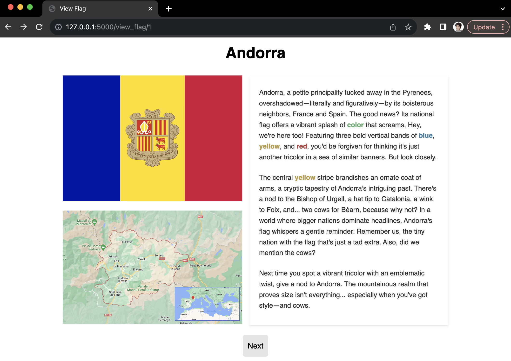

# <u>Enhancing Student Engagement through Reinforcement Learning and Eye-Tracking</u>

> Note: This document began as a proposal and a process log for the project and will be updated iteratively as the project progresses. The final version will serve as the formal README for the repository.

> **[2023-10-18]** Repo Initiation\
> **[Upcoming]** Demo UI

# Proposal

## Table of Contents
1. [Introduction](#introduction)
2. [Model Design](#model-design)
3. [System Workflow for an Individual User](#enhancing-student-engagement-through-reinforcement-learning-and-eye-tracking)
4. [References](#references)

## Introduction 

In the rapidly changing realm of education, personalization is increasingly crucial. While traditional Intelligent Tutoring Systems (ITSs) commendably tailor content to students, they rely on fixed pedagogical rules, potentially lacking the flexibility needed for genuinely individualized learning. Could the dynamism of Reinforcement Learning (RL) and the detailed insights from eye-tracking equipment provide a more adaptive learning experience?

Eye-tracking technology offers insights into a student's cognitive process, revealing their engagement levels, areas of interest, and potential confusion. When paired with RL, which flourished on continuous feedback, there's an opportunity to dynamically adapt educational content based on immediate student needs and reactions. As the eye-tracking system uncovers the student's focus and comprehension, the RL system can promptly adjust its pedagogical method.

In their paper *An Evaluation of Pedagogical Tutorial Tactics for a Natural Language Tutoring System: A Reinforcement Learning Appraoch* [1], Chi et al. highlighted the potential of RL in pedagogical strategies and showed that their RL-based tutor action selection can affect student outcomes. Inspired by them, this project aims to further integrate RL into education by combining it with eye-tracking systems. By capturing immediate student responses, we aim to gain deeper insights into their interests, paving the way for a more personalized learning experience. 

It's crucial to recognize that, while this project primarily emphasizes engagement without delving deep into other key educational outcomes, such as content retention or subjective learning experiences, engagement is indeed one of the most crucial metrics in learning, and is positively correlated to students' performance under other metrics. Students deeply engaged in their learning are not only more efficient at content assimilation but also nurture a sustained passion for education. This intrinsic connection to learning positively impacts a spectrum of academic metrics, from retention rates to grasping intricate topics, culminating in heightened overall satisfaction. Thus, by channeling our efforts into maximizing student engagement, we envision crafting a richer, more immersive educational milieu.

Zooming into the specifics of our initiative, we've curated learning materials pivoting around national flags. Given that participants may come from diverse cultural backgrounds, their interest and pre-knowledge in different flags, along with their learning preferences might vary, leading to differing optimal learning policies. Through interaction, the system proposed by this project aims to adapt to each student's learning preference, enhancing their ability engagement in the learning material.

In the subsequent proposal, we will detail the preliminary RL model and the application's workflow.

## Model Design

Reinforcement learning (RL) offers a methodical approach to optimizing the decision-making process through interactions with an environment. In the context of this project, the environment is the student's learning experience, and the agent's objective is to personalize this experience by strategically selecting which flags to show, thereby maximizing the student's engagement.

### State
The **state** in our RL model is a tuple of three elements:
- **Student Engagement Level**: The engagement level is deduced from the eye-tracking data and can be classified into three levels: low, medium, and high.
- **Previous Flag Familiarity**: This represents the familiarity category of the last flag shown to the student. It can take values: unfamiliar, not sure, or familiar.
- **Previous Flag Similarity**: A binary variable indicating whether the previously shown flag was similar or not to its predecessor.

> Note: The labels of familiarity — `unfamiliar`, `not sure`, and `familiar` — are pre-defined based on student reports prior to their interaction with the system. The similarity between flags is also predefined. Whether this similarity is determined manually or via a method like a neural network will be finalized as the project advances.

### Action
The agent's **action** is a tuple that consists of:
- **Flag Familiarity**: Deciding which flag familiarity category to present next: unfamiliar, not sure, or familiar.
- **Flag Similarity**: Choosing to present a flag that's either similar or dissimilar to the previous flag.

> Note: Once the familiarity and similarity levels are decided, a flag will be randomly drawn from the pool of flags satisfying the criteria.

### Reward
The **reward** is:
- **Student's engagement level**: After a flag is shown, this engagement can be quantitatively represented using specific numerical values, through data collected via the eye-tracking system. A low engagement level, indicating disengagement or potential confusion, is denoted by a value of -1. A medium engagement level, signifying neutral engagement, is given a value of 0; A high engagement level, reflecting a significant degree of interest or involvement, is marked with a value of 1.

### Expected Policy Relevance
We design the above model with expectations that the optimal policy may be relevant to:
- **Prior Student Engagement**: If a student was highly engaged with a particular flag, the optimal policy might choose a similar flag or one that's progressively more challenging.
- **Familiarity of Previous Flag**: Based on how familiar the student was with the previous flag, the RL model might decide on the next flag's difficulty.
- **Similarity to the Previous Flag**: The relation between consecutive flags might affect engagement.
- **Adaptive Difficulty**: The policy could adapt to the student's performance.

### RL Algorithm and Exploration Strategy
For the learning algorithm, we will implement Q-learning, a model-free, off-policy algorithm that seeks to learn the value of an action in a particular state. It does this by iteratively updating action values using a learning rate and a discount factor.

To balance exploration (trying new flags) and exploitation (showing flags based on what's been effective), we'll employ an epsilon-greedy strategy. Initially, the agent will mostly explore, but as it accumulates knowledge, it will shift towards exploiting that knowledge.

# System Workflow for an Individual User

## Stage 0: Knowledge Profiling

In a given trial, we will have a total of 100 flags. Students are presented with a task to rate their familiarity with each flag. They use a scale of 1 to 3, where 3 indicates a clear recognition of the nation associated with the flag, 2 suggests a vague remembrance without certainty of its national association, and `1` denotes unfamiliarity.

Upon completion of the profiling process, the system divides the 100 flags into two distinct groups. Care is taken to ensure both groups have a balanced representation of flags based on familiarity levels. One of these groups is randomly allocated as the test group, where the RL algorithm will be applied. The counterpart group, serving as the control, will experience a learning environment where materials are introduced in a randomized manner.

## Stage 1: Instruction Walk-Through

This phase is designed to acclimatize students to the system's functionalities and workflow with representative flags. In each example, the student will be shown a page with general information about the flag. On the left side of the page, they'll find the flag's visual representation accompanied by a map pinpointing the country's geographical location. Adjacently, the right half of the screen will be populated with textual insights. This includes a brief historical background of the flag and a deeper dive into distinctive patterns characterizing it. The students navigate to the next page via the button `next`.

## Stage 2: Experiments

In this phase, the sequence of appearance for the control group and the test group is randomized. The primary distinction between the test and control groups lies in how the algorithm determines the subsequent flag to display. For the control group, these decisions are made randomly. After each group's learning is finished, a quiz will be initiated to ask students to match flags with the nation names. This quiz is not involved in the RL algorithm but is taken into consideration when deciding whether the algorithm designed to enhance engagement also contributes to other learning outcomes.

## Stage 3: Post-Experiment Interview

At the conclusion of the experiment, we will conduct in-person interviews with each participant to understand their cultural background and gather feedback on their experience with the system. Specifically, we aim to discern any perceived differences between the test and control groups. The detailed questions and structure for these interviews will be provided in a subsequent outline.

## Appendix - demo UI

> Note: Texts are generated by ChatGPT.

## References
[1] [Chi, M., VanLehn, K., Litman, D., & Jordan, P. (2011). An evaluation of pedagogical tutorial tactics for a natural language tutoring system: A reinforcement learning approach. International Journal of Artificial Intelligence in Education, 21(1-2), 83–113.](https://psycnet.apa.org/record/2012-00897-006)